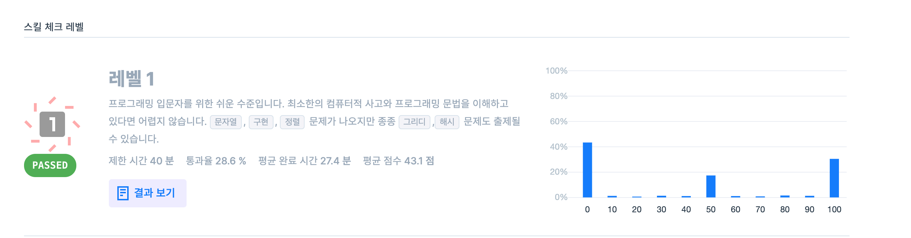

## 1번 문제

가운데 글자만 뽑기

```js
function solution(s) {
	var answer = "";
	if (s.length % 2 === 1) {
		answer = s[Math.floor(s.length / 2)];
	} else if (s.length % 2 === 0) {
		answer = s.slice(s.length / 2 - 1, s.length / 2 + 1);
	}
	return answer;
}
```

## 2번 문제

문자열 내림차순으로 배치하기

```js
function solution(s) {
	var answer = "";
	answer = [...s].sort((b, a) => (a > b ? 1 : a < b ? -1 : 0));
	return answer.join("");
}
```
